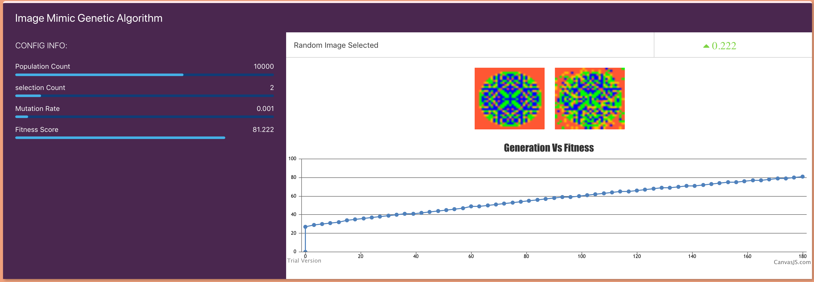

# Image-Mimic-Genetic-Algorithm
This genetic algorithm i have created will try to mimic the target image

View in https://karthiknedunchezhiyan.github.io/Image-Mimic-Genetic-Algorithm

## Meta

Karthik Nedunchezhiyan – [@Github](https://github.com/KarthikNedunchezhiyan) – karthik1705.n@gmail.com

Distributed under the MIT license. See ``LICENSE`` for more information.
