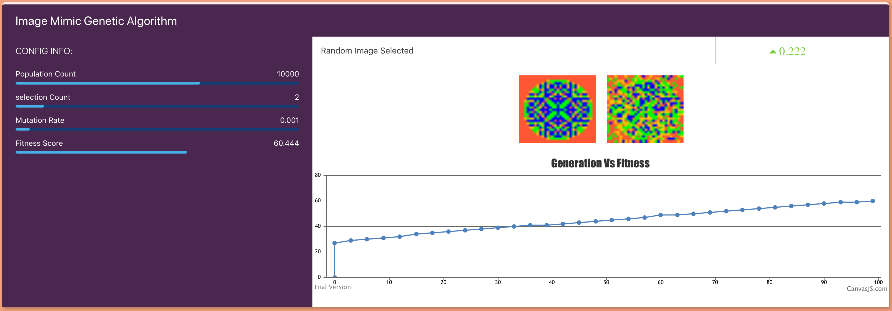
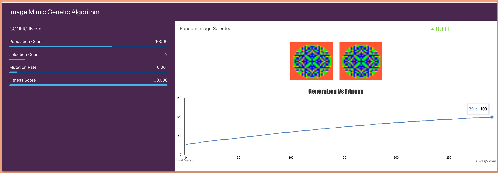

# Image-Mimic-Genetic-Algorithm
&nbsp;&nbsp;&nbsp;&nbsp;&nbsp;&nbsp;&nbsp;&nbsp;&nbsp;&nbsp;This unsupervised genetic algorithm i have created will try to mimic the target image (New random image will be generated at each time) || Demo in [@liveDemo](https://karthiknedunchezhiyan.github.io/Image-Mimic-Genetic-Algorithm) || You can also use my [@multi-level-snake-game](https://github.com/KarthikNedunchezhiyan/MultiLevel-Snake-Game) as a playground to practice Genetic Algorithm || Check my other works [@MyRepos](https://github.com/KarthikNedunchezhiyan) || To know more about Genetic algorithm [@WiKi](https://en.wikipedia.org/wiki/Genetic_algorithm)

&nbsp;&nbsp;&nbsp;&nbsp;&nbsp;&nbsp;&nbsp;&nbsp;&nbsp;&nbsp;I have used [@sandpile](https://en.wikipedia.org/wiki/Abelian_sandpile_model) algorithm to generate a random image at each time || GrainSize for sandpile will be taken random between 900 and 1150 (inclusive)

## Configurations

Hyperparameter | value
--- | ---
Population Count | 10000
Selection Count | 2
Mutation Rate | 0.001
Chromosome Length | 900

## Screenshots

    
    <em>Fitness reached 60% on 100th generation</em>

    
    <em>Fitness reached 100% on 291th generation</em>

  
View in https://karthiknedunchezhiyan.github.io/Image-Mimic-Genetic-Algorithm

## Components Used

[@ChartJS](https://www.chartjs.org/) for chart, [@P5JS](https://p5js.org/) for canvas

## Meta

Karthik Nedunchezhiyan – [@Github](https://github.com/KarthikNedunchezhiyan) – karthik1705.n@gmail.com

Distributed under the MIT license. See ``LICENSE`` for more information.

## Contributing

Suggestions are always welcome
